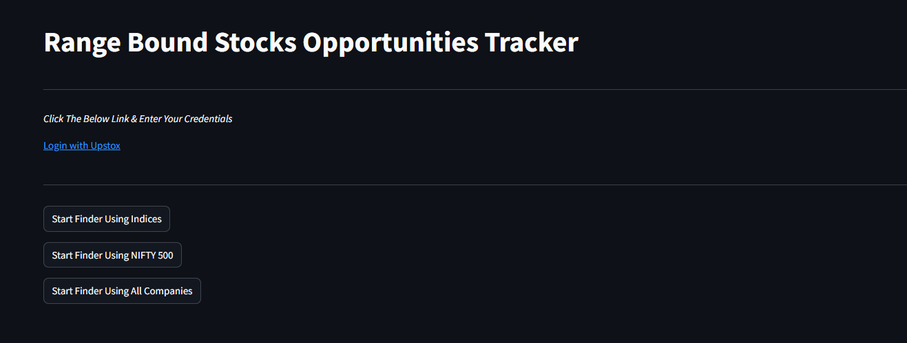

# AI-Powered Range Bound Stocks Finder

## Overview
The **AI-Powered Range Bound Stocks Finder** is a web application built using Streamlit that identifies range-bound stocks based on historical and real-time stock price data. It utilizes machine learning techniques, specifically a **Random Forest Classifier**, to predict stock behavior, aiding traders in making informed decisions.



## Features
- **Dynamic Analysis**: Users can input multiple stock tickers for real-time analysis.
- **Machine Learning Model**: Predicts range-bound conditions based on historical price data using a Random Forest algorithm.
- **Data Integration**: Fetches stock data from the **Yahoo Finance API** for both historical (3 months) and real-time (1-minute intervals).
- **Interactive User Interface**: Easy-to-use interface for entering stock tickers and viewing results.

## Technologies Used
- **Python**
- **Streamlit**
- **Pandas**
- **NumPy**
- **Scikit-Learn**
- **yfinance** (for data fetching)

## Installation
1. Clone the repository:
   ```bash
   git clone https://github.com/iamkrishnaagarwal/Range-Bound-Stocks-Opportunities-Tracker.git
  
2. Navigate to the project directory:
   ```bash
   cd main.py

## Usage

Run the Streamlit app:

streamlit run app.py

Open your browser and go to http://localhost:8501.

Select the appropriate choice that suits your risk profile 

## Features

- **Nifty Indices Wise**: Analyze range-bound stocks based on selected Nifty indices. This feature allows users to focus on specific market segments, such as Nifty Bank, Nifty IT, or other sectoral indices. By filtering stocks within these indices, users can identify potential trading opportunities tailored to specific sectors of interest.


- **Nifty 500**: This feature enables users to analyze the performance of stocks listed in the Nifty 500 index, which comprises the top 500 companies in India based on free float market capitalization. By assessing these stocks, users can identify those that are exhibiting range-bound behavior, assisting in strategic investment decisions within a broad market context.


- **All Companies Inside NSE**: Users can access and analyze all publicly listed companies on the National Stock Exchange (NSE). This comprehensive feature ensures that no potential opportunity is overlooked, allowing traders to find range-bound stocks across the entire NSE spectrum. Whether focusing on large-cap, mid-cap, or small-cap companies, this functionality provides a complete view of market dynamics.


## Disclaimer
**Use the Range Bound Stocks Finder at your own risk. The developers of this application bear no responsibility for any losses incurred as a result of using this tool. Trading in stocks involves risks, and it's essential to conduct your own research and consult with a financial advisor before making investment or trading decisions.**

   


